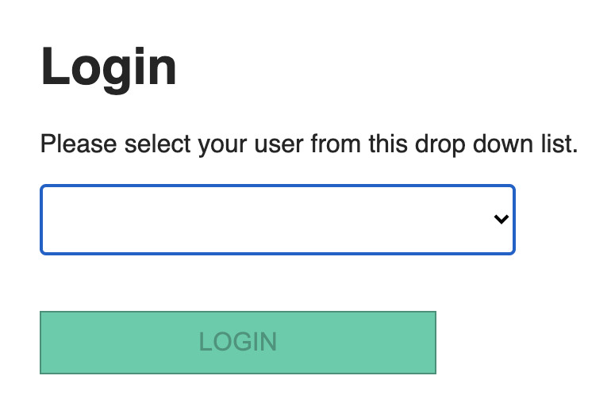
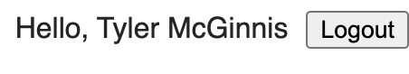
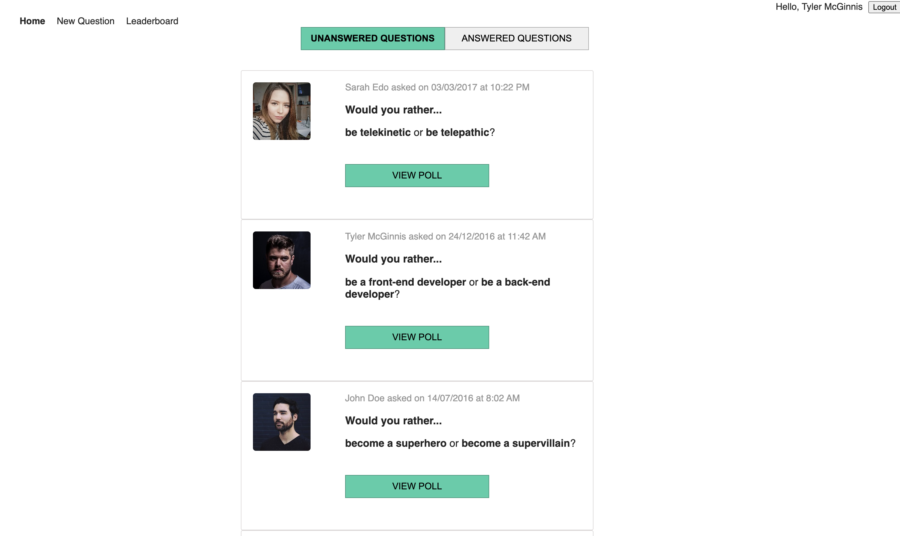
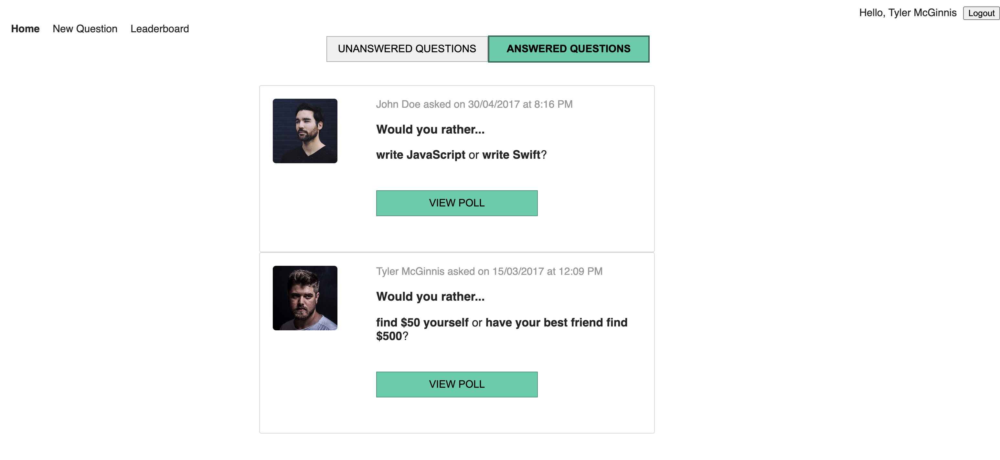
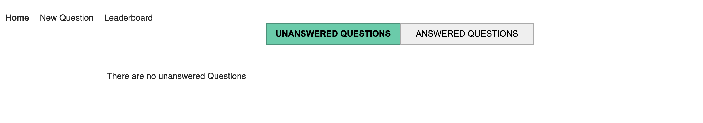
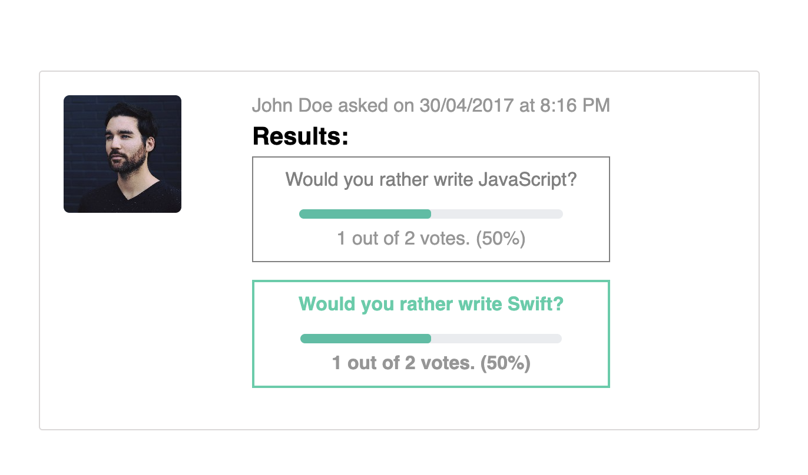
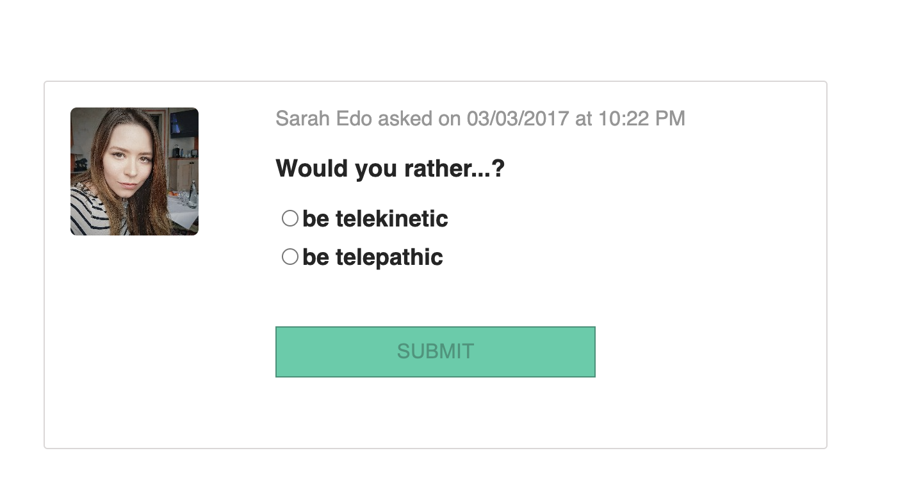
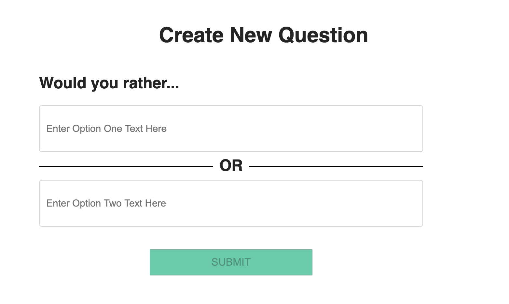
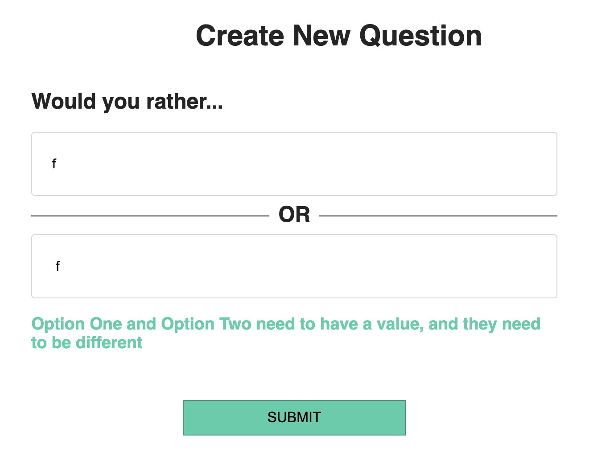
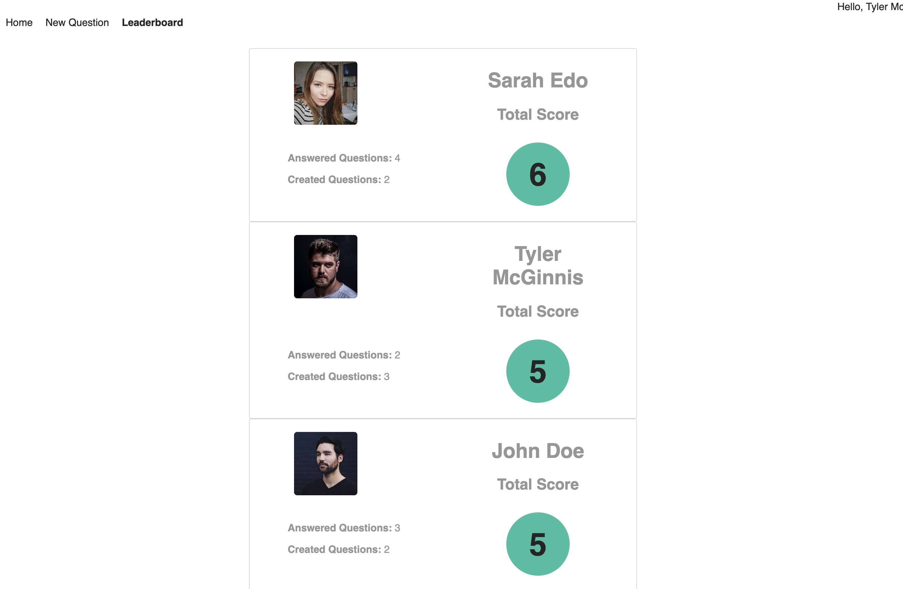

# Would You Rather...? Project

This is Belén Pruvost's assessment project for the React & Redux module, included in Udacity's React Nanodegree.

It is an app that allows you to browse through questions different users have asked. Each question has a 2 possible options. The user can only answer once to each question, and can submit new questions.

For already answered questions, information about how each option is performing is displayed.

There is also a leaderboard who shows all the users in the app, ordered from the most perfomant to the least performant. Performance is measure by the amount of asked and aswered questions.

## Running the app locally

- install all project dependencies with `npm install`
- start the development server with `npm start`

## Sections

### Login
This section allows a given user to _authenticate_ into the app, by selecting their name from a drop down list.

It's not a real authentication per se - but it simulates one.

The list of users displayed on the drop down are read from the API provided on the project.

If a user is not logged in and tries to browse to a question, they will be redirected to the login page.

Once the user has logged in, their name will be displayed on the nav bar, with an option that allows them to Log out.

### Logout
This button allows the user to log out of the app.

When selected, the user will be brought back to the login page.

### Nav Bar
If the user is logged in, a Nav bar will be displayed at the top. This allows the user to browse around the app.

### Home
This section allows the user to toggle between **Unanswered** and **Answered** questions.

Each question shows who was the user that submitted it, when, their avatar, and what are the options they provided.

If there are no answers that the user has answered yet, or if the user has already answered all the available questions, a message indicating so will be displayed.

#### Answered Question
If the user selects a question from the answered list, they will be able to see how the options are performing.

The user won't be able to change their answer, but they'll be able to see what was their original response.

#### Unanswered Question
If the user selects a question from the unanswered list, they will be able to provide a response.

Once the user has answered, they will be redirected to the Answered Question view, to see how the question is performing.

### New Question
In this section, the user can create a new poll for themselves and other users to answer.

If the user provides the same option twice, an error will be displayed. Spaces are not a valid option either.

Once the New Question has been submitted, it will be displayed among the Unanswered questions.

Since there is no actual database where this data is maintained, new questions defined by users won't be available when relaunching the app.

Users are able to ask several times the same question, but they won't be able to provide the same two options within a question.

### Leaderboard
In this section, the user can see a ranking of how all the users are performing in terms of asking and answering questions.

